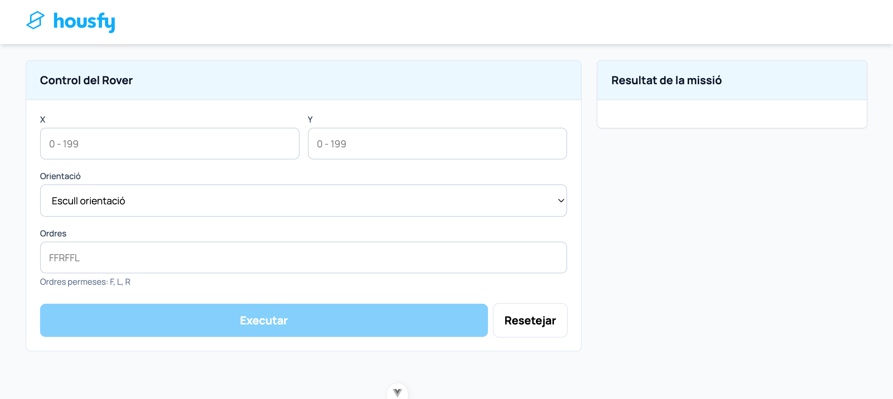
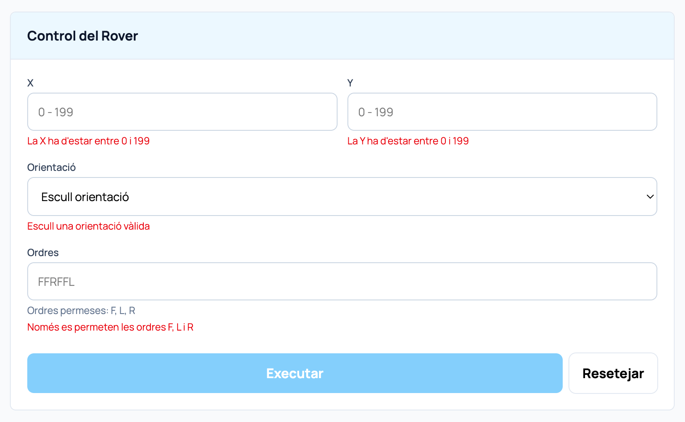
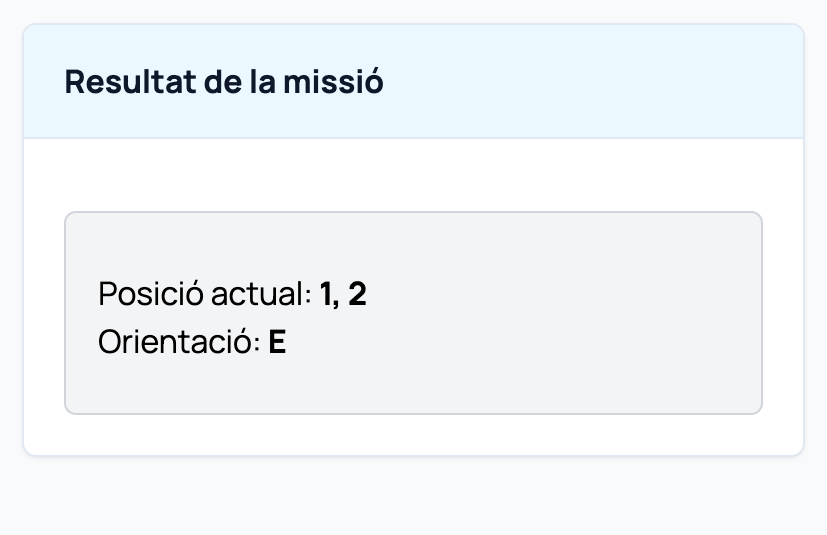
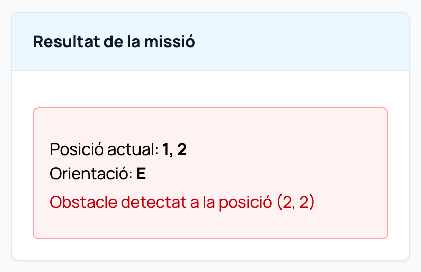
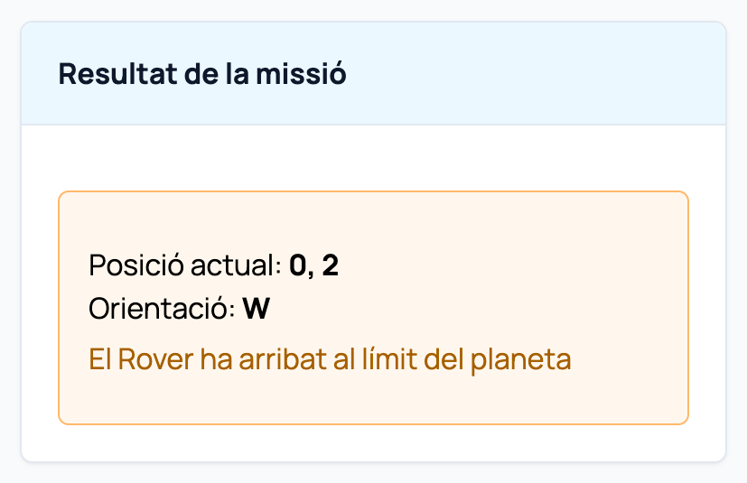

# Mars Rover Kata

This project is an implementation of the Mars Rover Kata.
The main goal is to practice clean code and simple architecture, using tests to guide the implementation.

The project simulates a rover moving on a square planet.
The rover receives commands and moves step by step.
If an obstacle is found, the rover stops and reports it.

---

## Tech Stack

- Backend: Laravel 10 with PHP 8.2
- Frontend: Vue.js 3
- Tests: PHPUnit
- Environment: Docker

---

## Problem Description

The rover starts at a position `(x, y)` and faces a direction:
`N`, `E`, `S` or `W`.

Commands:
- `F` → move forward
- `L` → turn left
- `R` → turn right

Before moving forward, the rover checks for obstacles.
If an obstacle is detected:
- the rover stops
- the remaining commands are not executed
- the obstacle position is returned

The planet is a square grid of **200 × 200**.
The rover cannot leave the planet limits.

---

## Development Approach

The project follows a Test-Driven Development approach.
Core rover logic is implemented as a separate domain layer,
independent from HTTP and framework concerns.

---

## Project setup

The project is fully Dockerized. A single `docker-compose.yml` file at the root
starts both backend (Laravel 10) and frontend (Vue.js).

The backend runs on PHP 8.2 and is exposed as an API-only Laravel application.

---

## Testing and TDD

The project uses **PHPUnit** for testing.

All business rules are tested at the unit level, focusing on observable behavior
rather than implementation details.

Tests are located under:

```
tests/Unit
```

The domain logic is tested independently from the framework.

---

## Domain Structure

The domain is implemented under the `Domain` namespace and is independent from Laravel.

### Rover

The `Rover` domain model represents:
- current position (`x`, `y`)
- current direction (`N`, `E`, `S`, `W`)
- execution of command sequences

The rover:
- can turn left and right
- can move forward
- executes commands sequentially
- aborts execution when an obstacle or invalid move is detected

### Planet

The `Planet` domain model represents:
- planet limits (200 × 200)
- obstacle positions

The planet is responsible for deciding whether a position is valid.

---

## API Usage

The backend exposes a single API endpoint to execute rover commands.

### Endpoint

```
POST /api/rover/execute
```

### Request example

```json
{
  "position": { "x": 0, "y": 0 },
  "direction": "N",
  "commands": "FFRFF",
  "planet": {
    "width": 200,
    "height": 200,
    "obstacles": [[2, 2]]
  }
}
```

### Successful response

```json
{
  "status": "OK",
  "position": { "x": 2, "y": 2 },
  "direction": "E"
}
```

### Response when an obstacle is found

```json
{
  "status": "OBSTACLE",
  "position": { "x": 1, "y": 2 },
  "direction": "N",
  "obstacle": { "x": 2, "y": 2 }
}
```

### Response when reach planet limit

```json
{
  "status": "OBSTACLE",
  "position": { "x": 0, "y": 0 },
  "direction": "W",
  "obstacle": null
}
```

### Notes

- Commands are executed sequentially.
- Execution stops immediately when an obstacle is detected.
- Remaining commands are not executed after an obstacle.

### Obstacle Configuration

Obstacles are defined on the frontend and included in the API request.
The current setup uses a single obstacle at position `(2, 2)`.

### API Testing

A Postman collection is included in the repository under the `/postman` folder.

The collection contains several requests that call the same API endpoint
using different inputs in order to demonstrate:
- normal rover execution
- obstacle detection
- planet limits checks
- input validation errors

---

## Frontend Overview

The frontend is built with Vue.js 3 using the Composition API.

Its responsibilities are limited to:
- collecting user input
- validating form data
- sending requests to the backend API
- displaying the execution result

No business logic related to rover movement exists in the frontend.



---

## Frontend Architecture

The frontend uses the following Vue 3 concepts:

- `ref` for simple reactive state (loading, API errors, results)
- `reactive` for grouped state objects (form data)
- `computed` for derived state (form validation)
- `fetch` for HTTP communication with the backend

Form validation is handled on the client side to provide immediate feedback to the user.

---

## Validation Strategy

Client-side validation ensures:
- coordinates are within planet limits (0–199)
- direction is one of `N`, `E`, `S`, `W`
- commands only contain `F`, `L` or `R` in uppercase

The backend performs the final validation and execution.
The frontend does not assume the backend will always return a successful result.

---

## Error Handling

The frontend handles two types of errors:
- validation errors before sending the request
- API or execution errors returned by the backend

If an error occurs during execution:
- the user is informed
- the last valid rover position is displayed when returned by the backend



---

## Frontend Result Outputs

| Success | Obstacle | Planet Limit |
|--------|----------|------------|
|  |  |  |

---

## Frontend Result Outputs

| Success | Obstacle | Planet Limit |
|--------|----------|------------|
|  |  |  |

---

## Run the Project

### Requirements
- Docker
- Docker Compose

### Start the project (backend + frontend)

From the project root:

```bash
docker compose up --build
```

This command starts:
- Laravel backend (API) on http://localhost:8000
- Vue frontend on http://localhost:5173

---

## Run the tests

From the project root:

```bash
docker compose exec backend php artisan test --testsuite=Unit
```

This runs the PHPUnit test suite inside the Docker container.